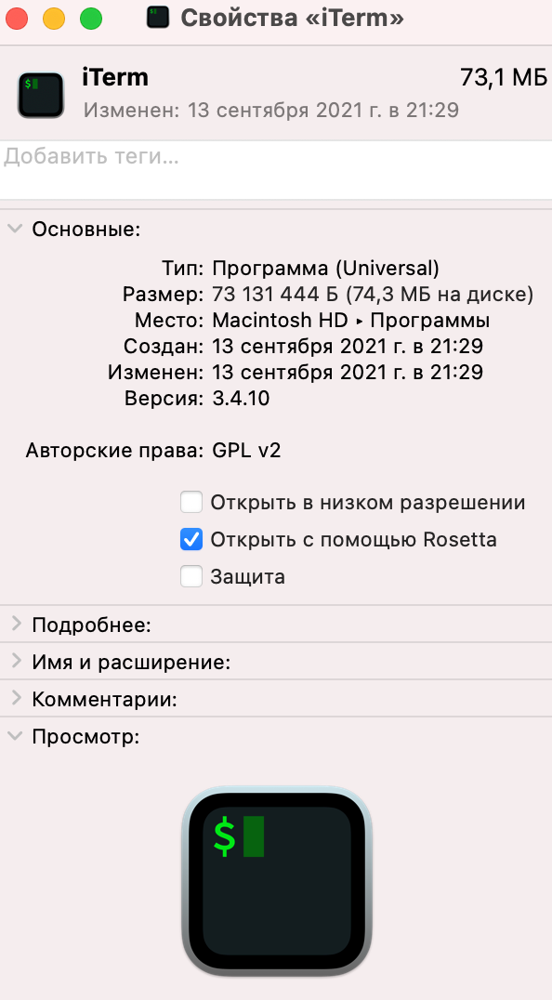

# Install Clickhouse ODBC on Apple Silicone M1

Инструкция по установке odbc драйвера clickhouse на процы M1

0. Установить iTerm2
1. В свойствах iTerm2 указать "Открыть с помощью Rosetta" (см. скриншот ниже)
2. Запускаем iTerm2
3. Выполняем команды:
```bash
/bin/bash -c "$(curl -fsSL https://raw.githubusercontent.com/Homebrew/install/HEAD/install.sh)"
alias ibrew='arch -x86_64 /usr/local/bin/brew' # put this in ~/.zshrc
```
4. Выполняем:
`ibrew install clickhouse-odbc`

